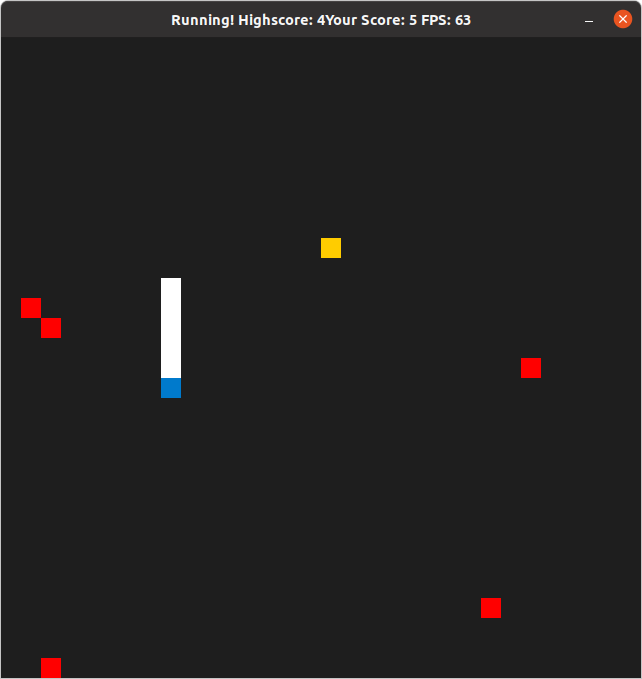

# CPPND: Capstone Snake Game Example

This is a submission in the [Udacity C++ Nanodegree Program](https://www.udacity.com/course/c-plus-plus-nanodegree--nd213). The code for this repo was inspired by [this](https://codereview.stackexchange.com/questions/212296/snake-game-in-c-with-sdl) excellent StackOverflow post and set of responses.

Starter code was provided by Udacity.

My Approach: I tried to let the provided code to stay at it is as much as possible. I added to integral features:
 - Mines are placed in the grid (red squares). The snake dies if it hits one of the mines and the game is over.
 - A highscore is persisted in a local file. Highscore is updated if the player finishes the game with a new highscore.

The Capstone Project gives you a chance to integrate what you've learned throughout this program. This project will become an important part of your portfolio to share with current and future colleagues and employers.

In this project, you can build your own C++ application or extend this Snake game, following the principles you have learned throughout this Nanodegree Program. This project will demonstrate that you can independently create applications using a wide range of C++ features.

## Dependencies for Running Locally
* cmake >= 3.7
  * All OSes: [click here for installation instructions](https://cmake.org/install/)
* make >= 4.1 (Linux, Mac), 3.81 (Windows)
  * Linux: make is installed by default on most Linux distros
  * Mac: [install Xcode command line tools to get make](https://developer.apple.com/xcode/features/)
  * Windows: [Click here for installation instructions](http://gnuwin32.sourceforge.net/packages/make.htm)
* SDL2 >= 2.0
  * All installation instructions can be found [here](https://wiki.libsdl.org/Installation)
  >Note that for Linux, an `apt` or `apt-get` installation is preferred to building from source. 
* gcc/g++ >= 5.4
  * Linux: gcc / g++ is installed by default on most Linux distros
  * Mac: same deal as make - [install Xcode command line tools](https://developer.apple.com/xcode/features/)
  * Windows: recommend using [MinGW](http://www.mingw.org/)

## Basic Build Instructions

1. Clone this repo.
2. Make a build directory in the top level directory: `mkdir build && cd build`
3. Compile: `cmake .. && make`
4. Run it: `./SnakeGame`.

## Rubric Points Covered

### Loops, Functions, I/O
1. The project demonstrates an understanding of C++ functions and control structures. 
  - uses multiple loops, conditionals etc. as well as basic I/O, programm is clearly organized into functions (Game::PlaceMines)
2. The project reads data from a file and process the data, or the program writes data to a file. 
  - Program uses a fiel to store the highscore. Data is read at each beginning of a game and written after it has stopped. (See highscore.cpp)
3. The project accepts user input and processes the input.
  - Program uses keyboard direction keys for steering the snake. 

### Object Oriented Programming
✔️ 1. The project uses Object Oriented Programming techniques.
  - Used provided classes and created HighScore class. 
✔️ 2. Classes use appropriate access specifiers for class members.
  - Used provided classes and created HighScore class, all members of additonally created classes provide explicit access specifiers. (e.g. _highScore as private member),
✔️ 3. Class constructors utilize member initialization lists. 
  - See highscore.h
✔️ 4. Classes abstract implementation details from their interfaces.
  - Used minimal interfaces and encapsulation. All functions document their effects through clear and speaking function names.
✔️ 5. Classes encapsulate behavior.
  - see 4.

### Memory Management
✔️ 1. The project makes use of references in function declarations.
  - e.g. Renderer::Render(... SDL_Point const &food ...)

### Concurrency
✔️ 1. Concurrency was not used. This is a simple program. A good approach to software engineering is avoiding over-engineering by using more complex techniques only were applicable and favorable. Understanding of concurreny was shown in the previous project "Concurrent Traffic Simulation".

## CC Attribution-ShareAlike 4.0 International

Shield: [![CC BY-SA 4.0][cc-by-sa-shield]][cc-by-sa]

This work is licensed under a
[Creative Commons Attribution-ShareAlike 4.0 International License][cc-by-sa].

[![CC BY-SA 4.0][cc-by-sa-image]][cc-by-sa]

[cc-by-sa]: http://creativecommons.org/licenses/by-sa/4.0/
[cc-by-sa-image]: https://licensebuttons.net/l/by-sa/4.0/88x31.png
[cc-by-sa-shield]: https://img.shields.io/badge/License-CC%20BY--SA%204.0-lightgrey.svg
